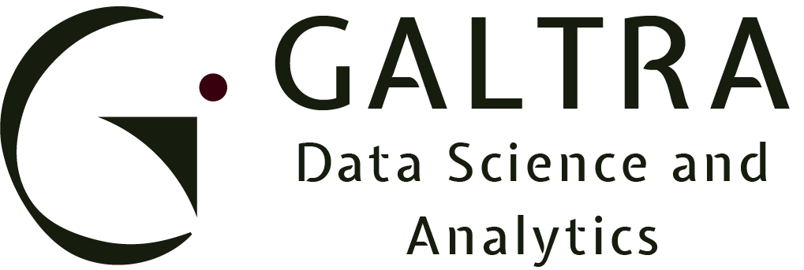

  

---
### Transformando Dados em Decisões Inteligentes
---

## Sobre Nós

A GALTRA é uma empresa especializada em Ciência de Dados e Inteligência Artificial, focada em transformar dados complexos em insights acionáveis e soluções inteligentes. Nossa missão é capacitar empresas a tomarem decisões mais inteligentes e estratégicas através da análise avançada de dados e implementação de tecnologias de IA.

Com uma equipe multidisciplinar de cientistas de dados, engenheiros de machine learning e especialistas em business intelligence, oferecemos soluções personalizadas que atendem às necessidades específicas de cada cliente, independente do setor ou tamanho da organização.

---

## Nossos Serviços

### 🔍 Análise de Dados Avançada
Transformamos dados brutos em insights valiosos através de técnicas estatísticas e visualização de dados de última geração.

### 🤖 Desenvolvimento de Soluções em IA
Criamos modelos de machine learning e deep learning customizados para resolver problemas específicos do seu negócio.

### 📊 Business Intelligence
Implementamos dashboards interativos e sistemas de BI que permitem monitoramento em tempo real dos indicadores-chave de desempenho.

### 🔮 Previsão e Modelagem Preditiva
Utilizamos algoritmos avançados para identificar tendências e prever comportamentos futuros, auxiliando na tomada de decisões estratégicas.

### 🧠 Processamento de Linguagem Natural (NLP)
Desenvolvemos soluções que permitem às máquinas entender, interpretar e gerar linguagem humana para análise de sentimentos, chatbots e muito mais.

### 📱 MLOps e Implementação
Garantimos que suas soluções de IA sejam implementadas de forma eficiente e escalável em ambientes de produção.

---

## Tecnologias

---

## Nosso Processo

1. **Descoberta** - Entendemos suas necessidades de negócio e definimos objetivos claros
2. **Coleta e Preparação de Dados** - Reunimos e organizamos os dados necessários
3. **Exploração e Análise** - Identificamos padrões e insights relevantes
4. **Modelagem** - Desenvolvemos algoritmos e modelos customizados
5. **Implementação** - Integramos as soluções ao seu ambiente de negócios
6. **Monitoramento e Otimização** - Garantimos a melhoria contínua das soluções

---

## Casos de Sucesso

- **Setor Financeiro**: Implementação de sistema de detecção de fraudes que reduziu perdas em 47%
- **Varejo**: Desenvolvimento de sistema de recomendação personalizada que aumentou as vendas em 23%
- **Manufatura**: Criação de modelo preditivo de manutenção que reduziu o tempo de inatividade em 35%
- **Saúde**: Algoritmo de diagnóstico assistido que melhorou a precisão em 28%

---

## Entre em Contato

Estamos prontos para ajudar sua empresa a aproveitar o poder dos dados e da inteligência artificial.

📧 **Email**: contato@galtra.com.br  
🌐 **Website**: www.galtra.com.br  
📱 **Telefone**: +55 (11) 9999-9999  
📍 **Endereço**: Av. Paulista, 1000, São Paulo, SP

---

© 2025 GALTRA. Todos os direitos reservados.

